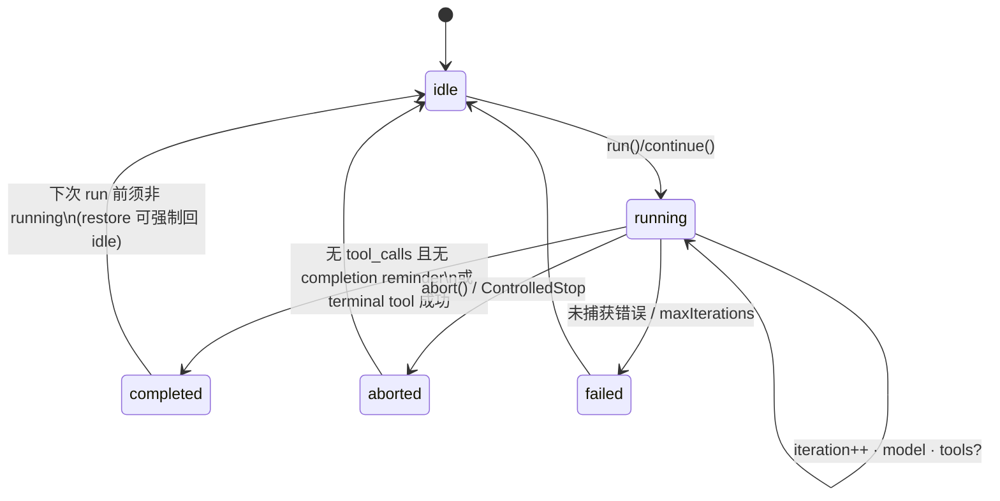

# Learn: Cline `AgentRuntime` ↔ XRK `runTurn`

> TODO: `lc1` — 读 `XRKbar/cline/sdk/packages/agents/src/agent-runtime.ts` 并画状态图，对照本仓。  
> 态度：学习 · 取精华 · **不搬** cline 源码树。

源文件（约 1.8k 行）：`AgentRuntime.execute` 主循环 + hooks + tool prepare/execute。

## 1. Cline 状态机（run 级）

`AgentRunStatus`：`idle | running | completed | aborted | failed`



要点：

- **同一 runtime 不可重入**：`status === "running"` 时再 `run` 直接 throw。
- **长寿对象**：`AgentRuntime` 持有 `messages[]`、tools、hooks、listeners；`run`/`continue` 短寿。
- **restore(messages)**：中止 in-flight，重置 usage/iteration，保留 subscribers/tools/model。

## 2. Cline 主循环（turn = iteration）

伪代码（`execute`，L641+）：

```text
beforeRun → run-started
append user input messages
optional completion-tool reminder (user message)

while iteration < maxIterations:
  turn-started
  assistant = model.stream (+ overflow recovery 最多一次)
  append assistant message
  if no tool_calls:
    if completion reminders: inject user reminders; continue
    else finish completed
  toolMessages = executeToolCalls (sequential | parallel)
  append each tool message
  if terminal tool (lifecycle.completesRun) success: finish completed

throw maxIterations
```

工具路径（精华）：

1. **prepare**：parse/schema normalize → `beforeTool` hooks（可改 input / policy / skip）→ toolPolicies + **approval callback**
2. **execute**：timeout/retry 在 tool 自身字段；结果进 `afterTool`（可替换 result）
3. 事件：`tool-started` → `tool-updated?` → `tool-finished`

## 3. 对照本仓 `runTurn`（`@xrkseek/core-agent-loop`）

| 维 | Cline `AgentRuntime` | XRK `runTurn` |
|----|----------------------|---------------|
| 对话真源 | runtime 内可变 `messages[]` | **session 事件日志** + `deriveMessages` |
| 一轮叫法 | `iteration` / turn-started | `turnId` + `stepId`（一步 = 一次 LLM） |
| 完成条件 | 无 tools，或 `completesRun` tool | 无 `tool_calls` 即 break（无 terminal-tool 语义） |
| 工具管道 | hooks before/after + policy + approval | 本仓 **ToolPipeline** waterfall（已拆开） |
| 并行 tools | `toolExecution: parallel\|sequential` | 目前逐步串行 |
| 流式 | model stream + chunk 事件 | M0/M1 多为整包 `chat()`；chunk 事件类型已有 |
| abort | AbortController + AbortError 类 | AbortSignal → AbortError |
| overflow | 自动 compact 再试 1 次 | 尚未做（outbound compaction hook 仍 noop） |
| 事件模型 | 丰富 RuntimeEvent + snapshot | session `SessionEvent` 偏事实日志 |

## 4. 取 / 不取

**取（后续小步 TODO，不在本条实现）：**

- run 级 `idle|running|…` 快照（CLI/HTTP 可观测）——对齐 `snapshot()`
- `continue` vs 新 `run` 语义文档化（session 长寿、loop 短寿）——见 lc7
- terminal / completion-tool 可选策略（AGT 办事助手有用）
- tool `parallel` 作为 pipeline/registry 配置，而非写死在 loop

**不取：**

- Effect / VS Code Hub / telemetry 全家桶
- 把可变 `messages[]` 当唯一真源（与 DSH/AGT「可重建」红线冲突）
- 整文件复制 `agent-runtime.ts`

## 5. 对本仓的直接含义

当前 `runTurn` ≈ Cline 循环的 **瘦核心**（user → model → tools\* → …），管道权限已外置到 `core-tools`，这点比把 beforeTool 全塞进 Runtime **更接近我们的分层目标（学 cline agents↔core 边界）**。

欠的主要是：**run 状态机外显**、**completion policy**、**overflow 一次恢复**、**parallel toolExecution**——应各开原子 TODO，不要一次塞回 loop。

---

勾选：`lc1` 完成（读源 + 状态图 + 对照表）。下一条建议：`lc2` session-runtime-orchestrator，或 `lc7` ADR。
