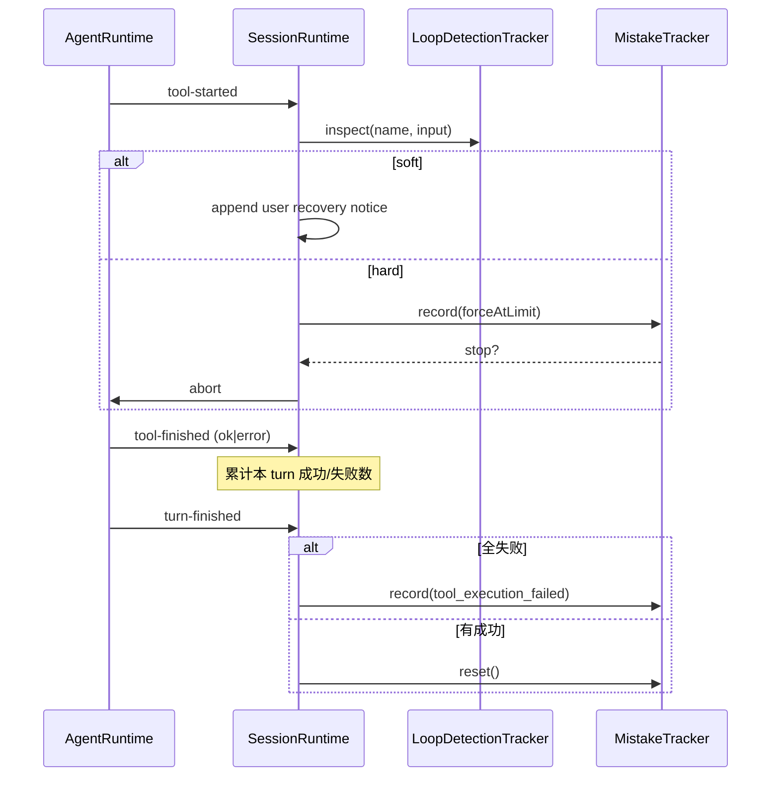

# Learn: Cline MistakeTracker · LoopDetectionTracker

> TODO: `lc3`  
> 源码：
>
> - `XRKbar/cline/sdk/packages/core/src/runtime/safety/mistake-tracker.ts`
> - `XRKbar/cline/sdk/packages/core/src/runtime/safety/loop-detection.ts`
> - 接线：`session-runtime-orchestrator.ts`（`handleRuntimeEvent` / `inspectLoopForToolCall` / `enqueueMistakeRecord`）
>
> 前置：lc1 / lc2 / [ADR-0003](../adr/0003-session-long-loop-short.md)。  
> 态度：详细学习 · 取精华 · **旁路挂 session，不塞进 `runTurn` 内核**。

---

## 1. 二者各自解决什么

| 组件 | 防什么 | 状态粒度 | 默认阈值 |
|------|--------|----------|----------|
| **MistakeTracker** | **连续失败**（API / 非法 tool / 整 turn 工具全失败）把会话拖死 | 跨 turn 累计；**有成功则清零** | `maxConsecutiveMistakes = 6` |
| **LoopDetectionTracker** | **同名 + 同参** 工具被模型反复调用 | 跨 tool-call 滑动；换签名即重置计数 | soft=3，hard=5；可 `false` 关闭 |

二者都挂在 **SessionRuntime（长寿）**，通过观察 AgentRuntime 事件驱动；**不是** AgentRuntime 内部 if 分支。

---

## 2. LoopDetection — 算法（纯函数 + 薄包装）

### 状态

```ts
{
  lastToolName: string
  lastToolSignature: string  // 规范化后的 input
  consecutiveIdenticalCount: number
}
```

### 签名

`toolCallSignature(input)`：

- `null` → `"null"`
- string / 原始类型 → `String`
- object → `JSON.stringify(sortKeys(deep))`（键排序，抗字段乱序）
- stringify 失败 → `String(input)`

### 判定 `checkRepeatedToolCall`

```text
若 name+signature 与上次相同 → count++
否则 count = 1
更新 last*

softWarning  := count === softThreshold   // 恰好等于 soft 时告警一次
hardEscalation := count >= hardThreshold
```

注意 soft 用 **`===`**：只在刚好撞 soft 阈值那一发告警，不会 soft+1、soft+2 连续刷屏。

### `LoopDetectionTracker.inspect` 裁决

| kind | 含义 | Session 侧动作（Cline） |
|------|------|-------------------------|
| `ok` | 无环 | 无 |
| `soft` | 达 soft | **append 一条 user 文本**（recovery notice，催模型换思路） |
| `hard` | ≥ hard | 当作「强制顶满」mistake：`forceAtLimit: true` → 可能 abort |

接线点：runtime 事件 **`tool-started`**（调用尚未结束就检查——防同一坏调用连打）。

可配置：`execution.loopDetection: false | { softThreshold?, hardThreshold? }`。

---

## 3. MistakeTracker — 算法

### 计数

```text
record(input):
  next = forceAtLimit ? max : consecutive + 1
  emit recoverable error 事件 + warn 日志
  if next < max → { action: "continue" }
  else → 问 onLimitReached? 否则默认 stop
       continue 决策：可 appendRecoveryNotice，并 **清零** consecutive
       stop 决策：返回停机文案（保留 session，请用户新 prompt）
```

### MistakeReason（本仓可对齐的枚举）

- `api_error`
- `invalid_tool_call`
- `tool_execution_failed`
- （文案 helper 还提到 `completion_without_submit`，record 主路径未用）

### Session 如何喂 mistake（重要）

**不是**每个 tool error 都 +1。在 **`turn-finished`**：

```text
若本 turn：failedTools > 0 且 successfulTools === 0
  → record(tool_execution_failed, details=聚合错误)
否则若 successfulTools > 0
  → mistakeTracker.reset()   // 有产出则打断「连续」
```

另：loop **hard** 走 `forceAtLimit: true`，一次顶到上限逻辑。

异步：`record` 是 async，事件流是 sync → `activeTrackerWork` promise 链串行；run 结束前 `await` drain。stop 时设 `trackerAbortInFlight`，append stop notice，`activeRuntime.abort(...)`。

---

## 4. 数据流总图



---

## 5. 与本仓映射（按 ADR-0003）

| Cline | XRK 应落点 | 不要落点 |
|-------|------------|----------|
| LoopDetectionTracker | session 壳 / host；或 **pipeline `onGuard` / pre** 读同一 tracker | `runTurn` 内写死 if |
| soft → user notice | **必须进 session 日志**（本仓：`safety/notice` 再投影）否则违反「模型可见可重建」 | 只打 logger、不写日志 |
| MistakeTracker | session 旁路，订 `turn/end` 或 step 汇总 | tool body 里私自计数 |
| turn 全失败才记 mistake | 在 **turn 边界** 看本 turn tool/result | 每个 isError 都 +1（过于敏感） |
| forceAtLimit + abort | host 持有 AbortSignal / AgentHandle.abort | 抛错淹没成普通 tool error |
| reset on productive turn | 同左 | 跨成功 turn 仍累加 |

### 与现有 ToolPipeline 的关系

- **Loop soft/hard** 很像 guard/pre：但「跨 call 记忆」属于 **session 级状态**，pipeline 实例若每 turn 新建会丢计数 → tracker 必须活在 session/composition 上，pipeline **注入** `onGuard(() => tracker.inspect…)`。
- **Mistake** 更像 turn 结束后的 **serial 观察者**，不是 waterfall 的一环。

### 事件建议（未来实现时，本条不写代码）

最小可观测集合（append-only）：

```text
safety/loop-soft   { toolName, count, message }
safety/loop-hard   { toolName, count, message }
safety/mistake     { reason, consecutive, details }
safety/mistake-limit { decision: continue|stop, message }
```

或先复用 `user/message` 注入 notice（Cline 做法），但要在文档标明「系统注入的 user，非人类」。

---

## 6. 取 / 不取

**取：**

1. 双轨：连续失败 ≠ 重复调用；算法保持简单可测（纯函数 `checkRepeatedToolCall` / `toolCallSignature`）。
2. soft 精确相等告警；hard 升级到 mistake 上限。
3. 「有成功则清零连续失败」——避免偶发错误耗尽额度。
4. tracker 挂 session；通过事件/钩子接线；可 disable。
5. stop 文案明确：**session 保留，发新 prompt 即可恢复**。

**不取：**

- 依赖 legacy `AgentEvent` emit 形状。
- soft notice 不入日志。
- 把阈值和 abort 写进 `runTurn` while 循环。
- 未理解 turn 边界就「每个 tool error +1」。

---

## 7. 建议的后续原子实现（仅立项，本条不做）

1. `packages/core/session-safety` 或 `packages/policy` 下纯函数 + Tracker 类（零 I/O）。
2. 单测：签名排序、soft 只触发一次、hard、mistake 清零、forceAtLimit。
3. `createHarnessComposition` 可选挂载；默认阈值对齐 CLI（3/5 与 6）。
4. docs：安全旁路 vs tool-pipeline 边界图。

---

勾选：`lc3` 完成。  
下一条建议：`lc4`（opencode session/runner + local execution）——对照另一家「会话/执行」切法。
