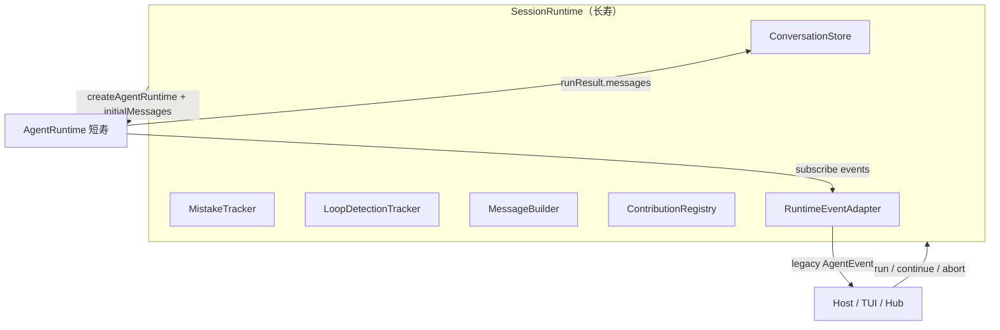

# Learn: Cline `SessionRuntime` ↔ XRK session / host

> TODO: `lc2` — 读  
> `XRKbar/cline/sdk/packages/core/src/runtime/orchestration/session-runtime-orchestrator.ts`  
> 态度：学习 · 取精华 · 不搬仓。接 `docs/learn/cline-agent-runtime.md`（lc1）。

## 1. 分层一句话

| 层 | Cline | 寿命 |
|----|-------|------|
| **SessionRuntime**（本文件） | 一会话的编排器：transcript、安全 tracker、扩展、abort、legacy 事件 | **跨多次 run** |
| **AgentRuntime**（lc1） | 单次 run 内的 model↔tool 循环 | **每次 run 新建** |
| **ConversationStore** | 可变消息数组 + conversationId | 随 SessionRuntime |

文件头注释写得很清楚：

> A fresh `AgentRuntime` is instantiated **per run**.  
> All session-level state **outlives** any one `AgentRuntime`.

这就是 lc7 要写的 ADR 素材：**session 长寿 · loop/runtime 短寿**。

## 2. SessionRuntime 职责图

### `run` vs `continue`（易混）

| API | 行为 |
|-----|------|
| `run(userMessage)` | `conversation.resetForRun()` → **清空历史 + 新 conversationId**，再执行 |
| `continue(...)` | **保留** ConversationStore，追加本轮 user（可选），再执行 |

执行共用 `executeRunInternal`：

1. 不可在 `running` / `shutdown` 后启动  
2. 可选 append user 到 ConversationStore（含多模态 content 组装）  
3. `composeSystemPrompt`（config + extension rules）  
4. 合并 config tools ∪ extension tools（**同名时 config 覆盖 extension**）  
5. `initialMessages = 当前 transcript` 注入新 AgentRuntime  
6. `runtime.run("")` / `continue(undefined)` —— **故意空输入**，避免与 seed 重复追加 user  
7. 结束后 `conversation.replaceMessages(runResult.messages)`  
8. Auth 失败可 `onAuthError` 后 **再 continue 一次**（不重放整段，从断点续）

### Abort 细节（值得记，别抄进核）

Hub 模式下 cancel 与 start 不在同一 await 链：对 `activeRunPromise` 挂 **空 `.catch()`** 只为避免 daemon 把预期的 abort rejection 当成 `unhandledRejection` 自杀。本仓若单进程 CLI/HTTP，**不必**先上这套；若以后做多进程 host 再对照这段注释。

## 3. ConversationStore（对照我们的 SessionStore）

Cline：

- `appendMessage` / `replaceMessages` / `resetForRun` / `restore`
- 真源是 **可变 Message 数组**
- `run()` 会换新 `conversationId`

XRK（已有）：

- `SessionStore.append` → **深冻事件**；`deriveMessages` 投影
- 无 `replaceMessages`（符合 append-only 红线）
- `forkSession` 用拷贝前缀代替「整表替换」

**吸取**：session 层应拥有「跨 turn 的安全/扩展/配置」；loop 只吃投影后的 messages。  
**不取**：用 `replaceMessages` 覆盖真源；把 `run()` 默认清历史——产品上应显式 `newSession` vs `continueTurn`。

## 4. 对照本仓映射（现状）

| Cline SessionRuntime | XRK 近似 | 差距 |
|----------------------|----------|------|
| ConversationStore | `core-session` SessionStore | 我们更强（事件可重建）；缺显式 continue/newSession API 命名 |
| 每 run 新 AgentRuntime | HTTP host **缓存** `AgentHandle` per sessionId | 我们偏「agent 长寿」；可改为每 turn 新建 loop 上下文、session 仍长寿 |
| MistakeTracker / LoopDetection | 无 | M1/M2 债；应挂 session 层，不进 `runTurn` 内核 |
| ContributionRegistry | kernel plugin + loader | loader 仍薄；热挂是 m2-s9 |
| MessageBuilder / prepareTurn | `assembleThreeLayers` + outbound | 形状接近；未接到「每 step 必经」的单一 prepare 门 |
| RuntimeEventAdapter | 无 | HTTP SSE 直接推 SessionEvent，暂时够用 |
| Auth retry once | 无 | 可放 server/host 或 llm adapter，不进 session 日志语义 |

## 5. 取 / 不取（本条结论）

**取（后续小步，本条不写代码）：**

1. 文档与 API 分清 **`newSession` / `continueTurn`**（不要静默 `resetForRun`）  
2. 坚持 **Session 长寿、单次 turn/loop 可重建**（AgentHandle 可缓存工具/pipeline，但 run 状态机按 lc1）  
3. Mistake / loop-detection 作为 **session 旁路**，喂事件、可 abort（对标 tracker 接线，而非塞进 pipeline body）  
4. 扩展 tools 合并规则：显式声明优先于插件同名

**不取：**

- legacy `AgentEvent` 双轨适配层（我们协议尚年轻，直接 SessionEvent）  
- Hub unhandledRejection 空 catch（无 hub 前不需要）  
- ConversationStore 式整表替换

## 6. 与 lc1 / lc7 的衔接

- lc1：AgentRuntime = 短寿循环内核  
- lc2：SessionRuntime = 长寿编排壳  
- lc7（下一步建议）：写一页 ADR——「XRK：session 事件日志长寿 + `runTurn` 短寿；禁止 messages[] 真源」

勾选：`lc2` 完成。
