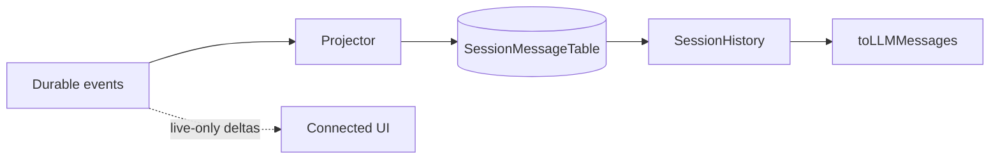

# Learn: OpenCode Projector · History ↔ XRK `deriveMessages`

> TODO: `lc6`  
> 源码 / 规格：
>
> - `XRKbar/opencode/specs/v2/session.md`（durable vs live-only、history API）
> - `packages/core/src/session/projector.ts` — 事件 → 消息表
> - `packages/core/src/session/history.ts` — Runner 读投影
> - 本仓：`packages/core/session`（`deriveMessages` / `assertModelVisible`）、`packages/protocol/src/session-events.ts`
>
> 前置：lc4–lc5、ADR-0003。态度：加固「可重建」红线 · **不**照搬 SQLite 投影层。

---

## 1. 两边的「真源」其实同构，读法不同

| | OpenCode V2 | XRK（现状） |
|--|-------------|-------------|
| **耐久真源** | durable `session.next.*` 事件流（aggregate seq） | `SessionStore` 事件数组（append-only + freeze） |
| **给模型看的形状** | `SessionMessage` 行（投影表） | `ChatMessage[]`（`deriveMessages` 纯函数） |
| **投影时机** | 事件 commit 时 **写库更新** message 行 | **读时** fold；不物化第二存储 |
| **Runner 输入** | `SessionHistory.entriesForRunner`（读投影 + compaction 窗口） | 通常 `deriveMessages(store.get().events)` |

共同点：**禁止用可变 messages[] 覆盖日志**。  
差别：OpenCode 为查询/分页/多消费者物化了一张消息表；我们 M0/M1 日志即读模型，更简单，也更贴「一份日志」。

---

## 2. OpenCode：Projector 在干什么

`SessionProjector` 订阅各类事件，调用 `SessionMessageUpdater`：

- **PromptAdmitted** → inbox 行（**仍不可见**）
- **Prompted** → 原子：可见 user message + inbox promoted
- **Text / Reasoning / Tool.\*** → 更新当前 assistant（或 append）
- **Step / Compaction / Revert / Shell…** → 各写各的投影语义
- **getCurrentAssistant**：只认 **最新一条未 completed** 的 assistant；注释写明——*更新的 turn 取代陈旧未完成行，绝不 resume 更旧的 assistant 投影*

规格补充：

- 投影消息保留 **source aggregate sequence**，分页/排序跟事件序，不跟调用方乱序 id。
- **`sessions.events` 第一版 = durable-only**：live 文本碎片不进 cursor、不重放。
- Compaction：**全 transcript 仍 durable**；Runner 的 *active* 窗口换成 checkpoint 后的消息。



---

## 3. XRK：`deriveMessages` 在干什么

```ts
user/message     → { role: user, content }
safety/notice    → { role: user, content }  // 耐久类型不同；投影同角色
assistant/message → { role: assistant, content, toolCalls? }
tool/result       → { role: tool, … }
其余（turn/step、tool/call、chunk…）→ 忽略
```

相对 Cline「直接 append 伪 user 文本」：本仓 **`safety/notice` 为真源**，UI/host 可区分系统注入；模型侧仍经 `deriveMessages` 可见（红线不变）。

`assertModelVisible(events, requestMessages)`：请求里的 messages 必须与 fold 结果 **JSON 全等**——这是红线的可测钉子。

注意：`tool/call` **有事件类型**，但不进入 `deriveMessages`；工具调用挂在 `assistant/message.toolCalls` 上。这与 OpenCode「Tool.Called 进 part、再投影」粒度不同，但只要 **发出去的请求能从日志重建** 就合规。

`forkSession` = 拷贝事件前缀 → 新 id（对标 revert/fork，无 replaceMessages）。

---

## 4. 对照表（学什么）

| 主题 | OpenCode | XRK 应保持 / 可吸 |
|------|----------|-------------------|
| 日志 append-only | ✅ | ✅ 已有 |
| 模型可见可重建 | 投影 + 历史 API | ✅ `assertModelVisible` |
| Admit 未可见 | inbox 直到 Prompted | 未来 admit API 时：未 promote 的不得进 derive |
| live vs durable | 明确拆开 | chunk 事件可存日志或仅推送；**若存则 derive 规则要写清**（现忽略 chunk） |
| Compaction | 换 active 窗口，旧事件仍在 | 未做；若做：**derive 或 outbound 层**切窗口，勿删日志 |
| 未完成 assistant | 新 turn 覆盖，不 resume 旧行 | loop 应避免「半条 assistant」污染下一请求；失败要有明确 end/fail 事件 |
| 分页 | `history({ after, limit })` by seq | 内存会话可后置；HTTP 列表先整段即可 |
| 物化消息表 | 有 | **暂不需要**；日志短时纯函数足够 |

---

## 5. 取 / 不取

**取：**

1. **Durable 与 live-only 话术**：SSE/UI 碎片 ≠ 重放真源。  
2. **投影规则写死 + 单测**（我们已有 invariant 测试方向）。  
3. **未 completed assistant 不被下一 turn 误续**（host/loop 结算纪律）。  
4. Compaction = **换窗口**，不是删事件。  
5. 事件带单调序（我们有 `ts`；若多写者再加 seq）。

**不取：**

- 立刻上 Drizzle 消息表 + Effect projector。  
- 把 `deriveMessages` 扩成 OpenCode part 级完整同构（成本高、收益低）。  
- 让 UI 订阅的 delta 偷偷进 `assertModelVisible` 路径却不落日志。

---

## 6. 对本仓的直接含义

当前设计 **已经站在正确一侧**（日志真源 + 纯投影）。相对 OpenCode，缺口主要在 **产品级事件语义**，不在「要不要投影表」：

| 缺口 | 说明 |
|------|------|
| chunk | `assistant/chunk` 存在则要么不入 store，要么 derive 规则文档化 |
| tool/call | 已记事件但 derive 不用——OK，须保证 assistant.toolCalls 与 call 事件一致（可加校验测试） |
| compaction / epoch | lc4 已立项，投影层以后再加「窗口参数」 |
| admit | lc4：未 promote 不得出现在 derive 结果 |

**建议原子测试（立项）：**  
`tool/call` 与随后 `assistant/message.toolCalls` 一致性；失败 turn 不得留下无 `tool/result` 的悬挂 call 却仍通过 invariant。

---

勾选：`lc6` 完成。  
OpenCode 主读线（lc4–lc6）收束。下一条建议：`lc8` 三方对照总表，或 `lc10` 短 ADR「不引入 Effect」。
