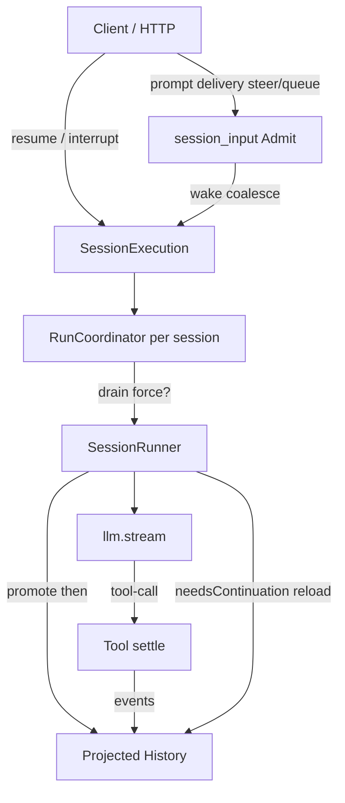

# Learn: OpenCode Session · Runner · Local Execution

> TODO: `lc4`  
> 源码 / 规格（优先读规格再读实现）：
>
> - 规格：`XRKbar/opencode/specs/v2/session.md`（**真源级契约**）
> - V2 编排：`packages/core/src/session/runner/llm.ts`（`SessionRunner`）
> - 进程门闩：`packages/core/src/session/run-coordinator.ts`
> - 本机路由：`packages/core/src/session/execution/local.ts` + `execution.ts`
> - V1 对照：`packages/opencode/src/session/prompt.ts`（`runLoop` / `loop`）+ `run-state.ts`
>
> 前置：lc1–lc3、[ADR-0003](../adr/0003-session-long-loop-short.md)。  
> 态度：详细学习 · 取精华 · **不引入 Effect** · 不搬仓。

---

## 1. 先分清两条线（避免读混）

| 线 | 入口 | 角色 | 本仓对照 |
|----|------|------|----------|
| **V1** `SessionPrompt.loop` | `ensureRunning(runLoop)` | 单体 while：读投影 messages → LLM → tool/subtask/compaction → 再读 | 接近「厚的」`runTurn` + host |
| **V2** `SessionExecution` + `SessionRunner` | `resume` / `wake` → `runner.run({ force })` | **录取（inbox）与执行（drain）分离**；每 provider turn 从 durable 历史重载 | 更接近我们想要的 session 真源 + 短寿 drain |

ADR-0003 已拒 Effect；学习 V2 时只吸 **语义**（admit / resume / wake / steer·queue / 同 session 串行），不吸 Layer/Fiber。

文件头 checklist（`runner/llm.ts`）写得很清楚：目标是「编排小协作方」，而不是再建一个 `SessionPrompt` 巨石。

---

## 2. 产品切分：录取 ≠ 执行

规格一句话：

```text
sessions.prompt({ …, delivery?, resume? })
  → 写入 durable inbox（PromptAdmitted）
  → resume≠false 时再 schedule 执行

SessionExecution.resume(sessionID)
  → 按 Session.location 选 Runner
  → SessionRunner.run({ sessionID, force? })
```

| 概念 | 含义 | 模型可见？ |
|------|------|------------|
| **Admit** | inbox 行已接受；可幂等按 message id 重试 | **否**（在 `Prompted` 之前） |
| **Promote / Prompted** | 投影成可见 user message | **是** |
| **resume(force)** | 显式开 drain；idle 时 force 可绕过「无合格输入」守卫 | — |
| **wake** | 「有新 durable 工作」；可 coalesce；**仅当能 promote 才打 provider** | — |
| **interrupt** | 打断本进程 drain；**不清** inbox | — |

**吸取：** host/API 应能「只记用户输入、稍后再跑」与「记完立刻跑」分开（我们 HTTP 若永远同步 `agent.run`，缺 admit-only）。  
**不急做：** SQLite inbox、跨进程 replica、集群 ownership（规格也标 deferred）。

---

## 3. Delivery：`steer` vs `queue`

| delivery | 何时进入可见历史 | 对正在跑的 drain |
|----------|------------------|------------------|
| **steer** | 下一个 **安全的 provider-turn 边界**（含 continuation 内） | 可插入；promote 后 **重置** agent step 配额（一批 steer 只重置一次） |
| **queue** | FIFO；当前 drain 仍需 continuation 时 **先不 promote** | drain 本要 idle 时 **一次只 promote 一条**，再评估是否继续 |

`SessionRunner.run` 外层伪逻辑：

```text
若 !force && 无 pending steer/queue → return
failInterruptedTools(session)   // 上次崩溃残留的 running tool → 记失败，禁止默默重放副作用
while shouldRun:
  while needsContinuation:
    runTurn(…); step++
    promotion 下一轮优先再吃 steer
  shouldRun = 还有 queue？ → 再开一段
```

**吸取（产品语义，以后 SDK 可选）：**

- 「插话纠正」≠「排队下一题」——与 Cline `continue` 单通道不同，OpenCode 显式两档。
- 崩溃后：**先结算悬挂 tool**，再组装下一请求。

**不取：** 立刻上完整 inbox 表；可先用 session 事件 + host 队列近似。

---

## 4. SessionRunCoordinator（门闩精华，可无 Effect 复刻）

`run-coordinator.ts` 语义（按 key=sessionID）：

| API | 行为 |
|-----|------|
| `run(key)` | idle → 启动 drain（force）；已有 → **join** 等结束 |
| `wake(key)` | 忙 → `pendingWake=true`（coalesce）；闲 → 启动非 force drain |
| `interrupt(key)` | 标 stopping、清 pendingWake、打断 owner |
| settle 成功且 pendingWake | **接棒** 再开一轮（successor） |

不同 session 可并发；**同一 session 至多一条 foreground drain**。  
`sessions.active()` 只反映本进程 foreground——重启后为空（**非 durable busy**）。

这与 ADR-0003「同 session 单 in-flight」一致；比 Cline 的 `running` 标志多了 **wake coalesce + join**。

**建议本仓 host 原子能力（立项，本条不写码）：**

1. `SessionLatch`：`run` / `join` / `wake` / `cancel`（Promise 即可）  
2. HTTP：忙时第二请求 → 409 Busy **或** join（产品二选一，先文档）

---

## 5. 一次 provider turn（V2 Runner 内核）

`runTurnAttempt` 骨架：

```text
fence Location（directory/workspace 变则 interrupt）
可选 promote steer|queue → 有 promote 则 step=1
装 Context Epoch / system baseline
读 SessionHistory → toLLMMessages
若达 max steps：工具置空 + 注入 MAX_STEPS 文案 + toolChoice none
compactIfNeeded →（缺陷转场）ContinueAfterCompaction
llm.stream(request)：
  增量 publish 文本 / reasoning / tool-call
  本地 tool-call：先 durable 记录，再 settle（eager fiber），stream 结束后 await 全部
若 needsContinuation → 外层 while 再跑下一 provider turn（**重载历史**，不持可变 messages[]）
```

对照本仓 `runTurn`：

| 维 | OpenCode V2 | XRK 现状 |
|----|-------------|----------|
| 真源 | durable events → 每 turn 投影 | `SessionStore` + `deriveMessages`（方向一致） |
| 一步 | 一次 `llm.stream` | 一次 `chat`/stream（M1） |
| 工具 | 先记后执行；并行 fiber；全 settle 再续 | ToolPipeline；多串行 |
| 步数上限 | agent.steps → 关工具 + 强制文本 | 尚无对等 |
| overflow | 估计 compact + 一次 overflow compact | 未做 |
| Location fence | 每 turn 校验 | workspace 有，未钉进 loop |

**吸取：** 「每续一步都从日志重载」强化 append-only；max-steps 用 **关工具 + 系统文案** 比硬 throw 更温和。  
**不取：** Effect FiberSet、Context Epoch 全家桶（可另开 learn）；多节点 Location map。

---

## 6. Local Execution 路由

```text
SessionExecutionLocal
  coordinator.drain(sessionID, force)
    → store.get → locations.get(session.location)
    → SessionRunner.run({ sessionID, force })
```

- **Execution / Store**：进程全局  
- **Runner / tools / fs**：按 **Location** 缓存  
- 注释：未来 remote placement 仍走同一 `SessionExecution` 接口；`noopLayer` 仅录音不执行

**吸取：** 「会话 ID → 工作区绑定 → 再执行」与我们 `apps → workspace` 纪律同构。  
CLI/HTTP 单机可先写死 implicit-local；接口上预留 `interrupt` / `active`。

---

## 7. V1 `runLoop` 仍值得记的边角

`SessionPrompt.runLoop`（厚 while）里与 V2 互补的点：

- 退出条件看 **finish + 是否仍有未结工具**（防 provider 报 stop 但还有 tool parts）
- subtask / compaction 作为 **消息流上的特殊 part**，不是 loop 外挂服务名
- `SessionRunState`：`assertNotBusy` / `ensureRunning` / `startShell` / `cancel`（含 background job 级联）

对照 ADR：V1 Runner = **忙闲门闩**；V2 Coordinator = **门闩 + wake**。都不是第二 transcript 真源。

---

## 8. 分层总图（学完应能默画）



---

## 9. 取 / 不取（lc4 清单）

**取：**

1. **Admit vs Execute** 分离；`resume false` = 只记账。  
4. **同 session 串行 + wake coalesce + join**（无 Effect 也可）— 本仓：`createSessionDrainHub` 已接 host。  
3. **steer / queue** 产品语义 — 已写 [session-delivery.md](../session-delivery.md)；steer 实现后置。  
4. 每 provider turn：**记工具 → 执行 → 全结算 → 重载历史 → 续**。  
5. 续跑前 **fail 悬挂 running tools**。  
6. max-steps：**禁工具 + 文案**，非直接炸循环。  
7. Location/workspace fence（概念）。

**不取：**

- Effect、LayerNode、Fiber、集群 ownership。  
- 立刻上 SQLite inbox / Context Epoch / 完整 compaction 规格。  
- 把 V1 `SessionPrompt` 巨石抄进 `core-agent-loop`。  
- 把 Busy 做成跨进程 durable（规格明确：active 仅本进程）。

---

## 10. 对本仓后续原子 TODO（仅立项）

| ID 建议 | 内容 | 依赖 |
|---------|------|------|
| host-latch | Promise 版 SessionLatch（run/join/wake/cancel） | ADR-0003 |
| api-admit | HTTP：admit-only vs admit+run | latch |
| loop-max-steps | `runTurn` 可选 maxSteps + 末步关工具 | agent-loop |
| loop-fail-dangling | turn 开始结算未完成 tool/result | session 事件约定 |
| delivery-doc | ~~产品文档 steer/queue~~ → [session-delivery.md](../session-delivery.md) | 规格对照 |

---

勾选：`lc4` 完成。  
下一条建议：`lc5` — opencode tool registry / settle 边界（对照本仓 ToolPipeline），或 `lc6` — projector / 事件重放与 `deriveMessages`。
